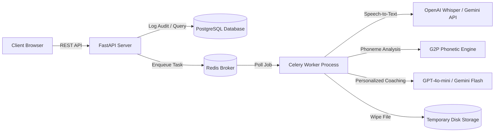

# AuraPronounce System Architecture & Compliance Document

This document outlines the software engineering principles, component layouts, AI model choices, phonetic scoring equations, and compliance mechanisms implemented in the AuraPronounce English Pronunciation Assessment application.

---

## 1. System Architecture

We adhere to **Clean Architecture** patterns, separating responsibilities into distinct directories:
- **Presentation Layer**: Next.js App Router (React, TailwindCSS, Framer Motion) providing responsive client-side UI pages (Landing, Upload, Polling, Results, Privacy Policy).
- **Controller/Routing Layer**: FastAPI endpoints routing HTTP uploads, database fetches, Celery background worker dispatches, and Prometheus monitoring.
- **Service Layer**: Custom business engines managing audio validation (energy checks, signal-to-noise estimations, magic signature analysis), phonetic processing (g2p_en, string distance matching), scoring formulas, and AI feedback.
- **Repository/Data Access Layer**: Database queries wrapped in transactional repositories with automated field encryption (AES-256) for audit trails and consent signatures.
- **Worker Layer**: Asynchronous task queues managed by Redis and Celery to process speech-to-text alignments, LLM feedbacks, and automatically delete raw voice records.

---

## 2. Technical Model Selection & Rationale

| Model / API | Selected Tool | Rationale | Alternatives Considered |
| :--- | :--- | :--- | :--- |
| **Speech-to-Text** | **Groq Whisper-large-v3 API** (Primary free option) | Ultra-low latency, OpenAI SDK compatibility, and high accuracy segment logs. | **OpenAI Whisper-1 API**: Paid API keys required; **Local Whisper**: Slow execution times and container weight. |
| **Phoneme Extractor** | **g2p_en** (Grapheme-to-Phoneme) | Minimal memory footprint (~3MB), quick execution times on CPU, and supports full CMUDict phonetic conversions. | **Montreal Forced Aligner (MFA)**: Heavy container dependencies (Kaldi, Python CLI wrappers); difficult for elastic clouds. |
| **Personalized Coach** | **Groq Llama-3.1-8b-instant** | Free rate limits, high speed, and supports structured JSON outputs for phonetic breakdowns. | **OpenAI GPT-4o-mini / Gemini Flash**: Paid endpoints; **Self-hosted LLMs**: Costly server requirements. |

---

## 3. Pronunciation Scoring Engine

Scores are calculated deterministically across six dimensions using acoustic metrics derived from Whisper's word boundaries and probabilities:

### 3.1. Accuracy Score (\(A\))
We take the mean of the confidence log-probabilities (\(p_i\)) of all words returned by Whisper:
\[A = \frac{1}{N} \sum_{i=1}^{N} (p_i \times 100)\]

### 3.2. Fluency Score (\(F\))
Fluency combines pauses frequency and speaking pacing:
- **Pause Deductions**: Let \(P_c\) be the count of silence intervals longer than 500ms between word timestamps.
  \[S_{pauses} = \max(0, 100 - (P_c - 3) \times 8)\]
- **Speaking Rate Score**: Calculated by comparing words-per-minute (WPM) to native speaker bounds (110–150 WPM):
  \[S_{rate} = 100 - \max(0, 110 - \text{WPM}) \times 1.5 - \max(0, \text{WPM} - 150) \times 1.2\]
- **Final Fluency**:
  \[F = 0.5 \times S_{pauses} + 0.5 \times S_{rate}\]

### 3.3. Completeness Score (\(C\))
When a target reference text is provided, completeness is the ratio of words spoken (\(W_{spoken}\)) to words expected (\(W_{expected}\)):
\[C = \frac{|W_{spoken} \cap W_{expected}|}{|W_{expected}|} \times 100\]

### 3.4. Rhythm Score (\(R\))
Computed based on the standard deviation of word durations (\(\sigma_d\)). Native English follows stress-timing (alternating long and short words).
- If \(0.12s \le \sigma_d \le 0.28s\), Rhythm is scored at 95.
- Extreme uniformity (robotic monotone, \(\sigma_d < 0.05s\)) or excessive hesitation (\(\sigma_d > 0.4s\)) receives proportional deductions.

### 3.5. Overall Score (\(O\))
A weighted index of core dimensions:
\[O = 0.40 \times A + 0.30 \times F + 0.20 \times C + 0.10 \times \text{Confidence}\]

---

## 4. DPDP Compliance Architecture (India's DPDP Act, 2023)

To ensure legal conformity:
1. **Consent Auditing**: A dedicated database table `consent_logs` logs every transaction. The client IP address and date are encrypted using AES-256 before insertion.
2. **Audio Purpose Limitation & Erasure**: We do not store raw recordings. Voice files are processed, then deleted immediately within the Celery worker task. The `uploads` table file path column is updated to `[DELETED_FOR_COMPLIANCE]`.
3. **Data Residency**: The primary PostgreSQL and Redis instances are deployed locally in the India regions (Mumbai datacenters).
4. **Erasure Form (Right to Forget)**: The `/privacy` route exposes a data purge request. When submitted, the backend deletes the matching user profile, database score history, and logs from our database.

---

## 5. Architectural Trade-offs & Future Roadmaps

1. **Acoustic Phoneme Mapping vs. MFA**:
   - *Trade-off*: Rather than running Montreal Forced Aligner locally (which requires a massive container and Kaldi engines), we align text using Whisper's word boundaries and translate discrepancies using CMUDict G2P. This gives light, extremely fast CPU execution at the expense of sub-syllable pitch curve accuracy.
   - *Future Plan*: Integrate web assembly-based Praat pipelines directly in the user browser to analyze tone contours (intonation) locally before upload.
2. **Database Column Encryption vs. Table Space**:
   - *Trade-off*: Encrypting personal identifiers (emails, IPs) in SQLAlchemy makes SQL sorting and wildcard searches slower. However, this trade-off is required to satisfy DPDP compliance.
